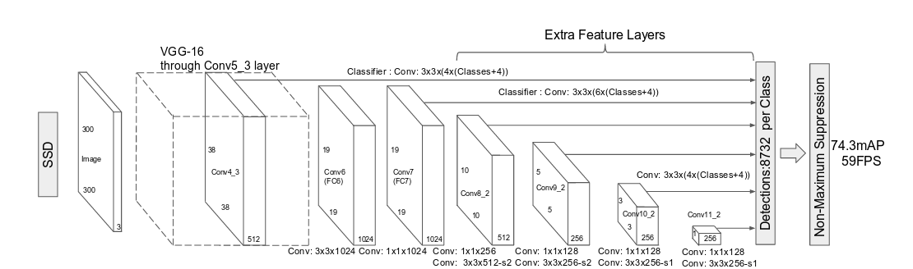

## Person-Tracking
This repository contains the code for person traing using SSD and centriod.

### Project Structure
```
├── ckpt_	             # Weight file
├── images               # Images 
├── input-data           # Input data for detection.
├── Readme               # Readme for Face-detection-SSD
├── requiremnts          # Requirements file for Facenet-detection-SSD
```

#### Single Shot Detector - SSD :
Single-shot MultiBox Detector is a one-stage object detection algorithm. This means that, in contrast to two-stage models, SSDs do not need an initial object proposals generation step. This makes it, usually, faster and more efficient than two-stage approaches such as Faster R-CNN, although it sacrifices performance for detection of small objects to gain speed.

#### Require packages:

`virtualenv --python=python3 env_fds`

`source env_fds/bin/activate`

`pip install -r requirements.txt`


#### [RESULTS](result):

##### Architecture of SSD :
Single class object detection models will need less learnable features. Less parameters mean that the network will be smaller. Smaller networks run faster because it requires less computations.





#### Research Paper Reference for this repository:

1. [SSD: Single Shot MultiBox Detector](https://arxiv.org/abs/1512.02325)

2. [AN ALGORITHM FOR CENTROID-BASED TRACKING OF MOVING OBJECTS](https://pdfs.semanticscholar.org/8461/7541ad311942be796095cb54e970c578307c.pdf)

